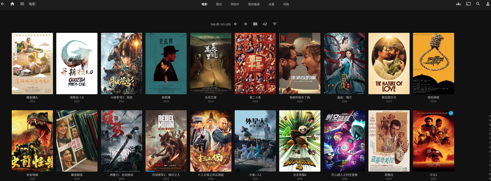

# Movie Excavator 
电影捕获器,通过jellyfin做展示


## 展示



## 功能
1. 自动解析电影信息
2. 评分机制判断是否下载电影
3. 自动下载
4. 通过jellyfin友好展示及播放电影，自动获取电影封面及演员等信息。

## 组件
1. jellyfin: 电影展示， 播放。
2. aria2-pro： 下载器
3. ariaNg: aria2-pro的web端可视化展示 (一般用不到)
4. sqlite: 电影下载过程中的信息存储和状态更新。
5. Excavator: 自定义实现电影获取、判断、提交下载、状态更新等内容。

## 安装
## 环境依赖
1. docker
2. docker-compose

### 配置文件说明
所有配置文件均在docker-compose.yml文件中。
```
version: "3"

services:
    jellyfin:
      image: linuxserver/jellyfin:latest
      container_name: jellyfin
      devices:
        - /dev/dri:/dev/dri
      environment:
        - PUID=0
        - PGID=0
        - TZ=Asia/Shanghai
      volumes:
        - ./jellyfin_config:/config
        - /your/host/path/movies:/data/movies   # 这里需要自定义电影存储位置,可以挂载单独的移动硬盘
      ports:
        - 127.0.0.1:8096:8096
      privileged: true
      extra_hosts:
        - "image.tmdb.org:143.244.50.85"
        - "api.themoviedb.org:143.204.126.6"
        - "api.themoviedb.org:143.204.126.22"
        - "api.themoviedb.org:143.204.126.104"
        - "www.themoviedb.org:99.86.199.99"
        - "www.themoviedb.org:99.86.199.23"
        - "www.themoviedb.org:99.86.199.8"
      restart: unless-stopped
      networks:
        - movieExcavator

    AriaNg:
      image: p3terx/ariang
      container_name: ariang
      ports:
        - 127.0.0.1:6880:6880
      restart: unless-stopped
      logging:
        options:
          max-size: 1m
      environment:
        - PUID=$UID
        - PGID=$GID
      networks:
        - movieExcavator

    Aria2-Pro:
      image: p3terx/aria2-pro
      container_name: aria2pro
      restart: unless-stopped
      ports:
        - 127.0.0.1:6800:6800
        - 127.0.0.1:6888:6888
        - 127.0.0.1:6888:6888/udp
      environment:
        - PUID=$UID
        - PGID=$GID
        - UMASK_SET=022
        - RPC_SECRET=123456   # 这里自定义一个秘钥
        - RPC_PORT=6800
        - LISTEN_PORT=6888
        - TZ=Asia/Shanghai
        - DISK_CACHE=64M
        - IPV6_MODE=false
      volumes:
        - ./aria2-config:/config
        - ./downloads:/downloads
      logging:
        options:
          max-size: 1m
      networks:
        - movieExcavator

    MovieExcavator:
      image: movie:latest
      container_name: movie_excavator
      restart: unless-stopped
      volumes:
        - ./data:/app/data
        - ./logs:/app/logs
        - ./downloads:/downloads
        - /your/host/path/movies:/movies  # 同上，自定义电影文件最终存储位置
      environment:
        - PUID=$UID
        - PGID=$GID
        - MOVIE_ARIA2_HOST=http://Aria2-Pro
        - MOVIE_ARIA2_PORT=6800
        - MOVIE_ARIA2_SECRET=123456  # 这里需要自顶一个秘钥,保持与上文秘钥一致
      networks:
        - movieExcavator

networks:
  movieExcavator:
    name: movie_excavator
    external: false

```

### 启动
```
sudo docker-compose up -d
```

访问： http://127.0.0.1:8096

另外，可以通过NGINX自定义反向代理，请自查研究。